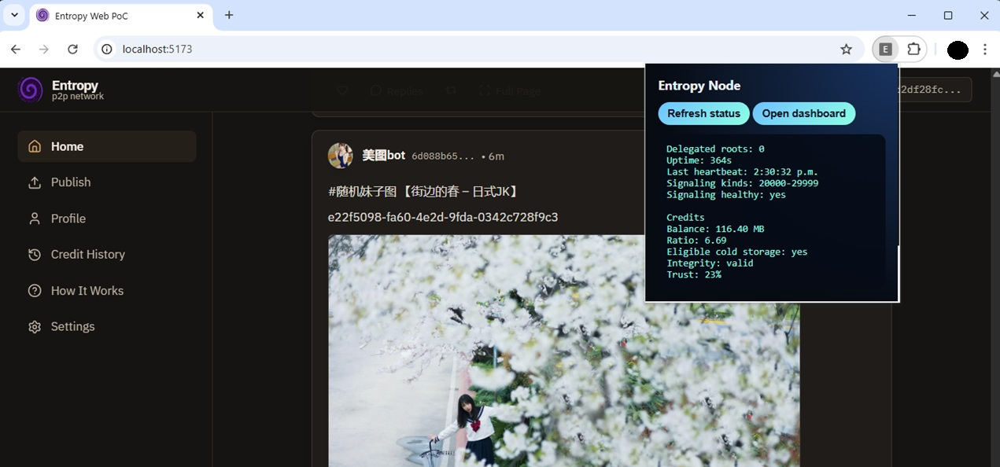

<div align="center">

# 🌀 Entropy

**Decentralized Multimedia Layer for Nostr — Browser-as-a-Node P2P Network**

"The Internet must be free and decentralized"

Share video, audio, and images across a peer-to-peer network without centralized servers.
Every browser becomes a node. Every upload feeds the swarm.



</div>

---

## What is Entropy?

Entropy is a **Layer 2 protocol for decentralized social networks** that enables the exchange of heavy multimedia content (video, 4K, audio, images) without relying on centralized servers or expensive storage relays. It runs entirely in the browser using a **Browser-as-a-Node** architecture and a bandwidth reciprocity incentive system.

Content is split into 5 MB chunks, hashed into a Merkle tree, and published as a **Nostr kind:7001 Chunk Map** event. Peers discover content through Nostr relays and exchange chunks directly via **WebRTC DataChannels** — encrypted, verifiable, and fully decentralized.

## Try it

Download and install the extension from the [releases](releases/) folder.

[Navigate to Entropy](https://hackers.army/entropy/)

### Key Features

- **P2P Streaming** — Progressive playback via MediaSource Extensions while chunks download from multiple peers in parallel
- **Chunk Maps on Nostr** — Content metadata lives on Nostr (kind:7001); binary data travels peer-to-peer
- **Credit Economy** — Bandwidth reciprocity with cryptographically signed Proof of Upstream receipts
- **Background Seeding** — Browser extension keeps serving chunks even when the tab is closed
- **Cold Storage** — High-ratio seeders earn premium credits by hosting unpopular content
- **Plausible Deniability** — Nodes only hold opaque binary fragments; no single node possesses recognizable content
- **Keyframe-Aligned Chunking** — Video chunks align to keyframes (IDR) for seamless MSE playback from any segment
- **Credit Integrity** — Tamper-resistant hash-chain ledger + peer-signed receipts prevent credit manipulation

---

## How It Works

```
┌─────────────────────────────────────────────────────────────────────┐
│                         USER'S BROWSER                              │
│                                                                     │
│  ┌──────────────────────┐     ┌──────────────────────────────────┐  │
│  │   Extension Entropy  │◄───►│        Web App Entropy           │  │
│  │  (Manifest V3)       │     │     (SPA — React + Vite)         │  │
│  │                      │     │                                  │  │
│  │ • Service Worker     │     │ • Social Feed (Nostr)            │  │
│  │ • Background Seeding │     │ • Media Player (MSE)             │  │
│  │ • Node Dashboard     │     │ • Upload Pipeline                │  │
│  │ • Credit Ledger      │     │ • Profile & Settings             │  │
│  └──────────┬───────────┘     └───────────────┬──────────────────┘  │
│             └────────────┬────────────────────┘                     │
│                          ▼                                          │
│              ┌───────────────────────┐                              │
│              │    @entropy/core      │                              │
│              │   (Shared Library)    │                              │
│              │                       │                              │
│              │ • Chunking + Merkle   │                              │
│              │ • WebRTC Transport    │                              │
│              │ • Nostr Protocol      │                              │
│              │ • Credit Ledger       │                              │
│              │ • IndexedDB Storage   │                              │
│              └───────────┬───────────┘                              │
│                          │                                          │
└──────────────────────────┼──────────────────────────────────────────┘
                           │
            ┌──────────────┼──────────────────┐
            ▼              ▼                  ▼
     ┌────────────┐ ┌────────────┐   ┌──────────────┐
     │ Nostr      │ │ WebRTC     │   │ STUN / TURN  │
     │ Relays     │ │ Peers      │   │ Servers      │
     │ (Metadata) │ │ (Data P2P) │   │ (Signaling)  │
     └────────────┘ └────────────┘   └──────────────┘
```

**Upload → Seed → Play in 5 stages:**

1. **Chunk** — File is split into ~5 MB pieces (keyframe-aligned for video)
2. **Hash** — SHA-256 per chunk → Merkle root for integrity
3. **Store** — Chunks persisted in IndexedDB via the browser extension
4. **Delegate** — Extension activates WebRTC seeding in the background
5. **Publish** — kind:7001 Chunk Map event signed and published to Nostr relays

Other users discover the content in their feed, connect via WebRTC signaling over Nostr ephemeral events (kind:20001), and download chunks in parallel from multiple peers with progressive streaming playback.

> 📖 Deep dives: [`architecture.md`](./docs/architecture.md) · [`flow.md`](./docs/flow.md)

---

## Why a Browser Extension?

A regular web page is **ephemeral** — the moment you close or navigate away from a tab, all JavaScript execution stops. For a P2P network that depends on nodes staying online to serve chunks to other peers, this is a fundamental problem.

The Entropy browser extension solves this by running a **Manifest V3 Service Worker** — a persistent background process that continues operating even when the web app tab is closed. This is the architectural reason the extension is not optional for uploaders and seeders.

| Capability | Without Extension | With Extension |
|---|---|---|
| **Background seeding** | ❌ Stops when tab closes | ✅ Service Worker keeps serving chunks 24/7 |
| **Chunk storage** | ⚠️ Session only — volatile | ✅ Persisted in IndexedDB, survives restarts |
| **Identity / Keypair** | ⚠️ Relies on NIP-07 extension (e.g. Alby) | ✅ Managed in `chrome.storage`, always available |
| **Credit ledger** | ❌ Lost on page refresh | ✅ Persisted and hash-chain protected |
| **Signaling listener** | ❌ Offline when tab closes | ✅ Always online, ready to answer WebRTC offers |

### What the Extension Does in the Background

```
Browser Tab (closed)              Extension Service Worker (alive)
                                  ┌──────────────────────────────┐
                                  │  • Listens for WebRTC offers │
                                  │    via Nostr ephemeral events │
                                  │  • Serves chunk requests from │
                                  │    the IndexedDB chunk store  │
                                  │  • Earns credits for uploads  │
                                  │  • Verifies cold storage      │
                                  │    custody challenges         │
                                  │  • Prunes stale data (LRU)   │
                                  └──────────────────────────────┘
```

Without the extension, Entropy still works as a **viewer and downloader** — you can watch content and browse the feed. But to **upload, seed, or earn credits**, the extension is required. This is by design: it ensures that seeders are reliable long-term nodes, not ephemeral browser tabs.

> 🔌 **Install the extension** → see [Build the Browser Extension](#build-the-browser-extension) below.

---

## Monorepo Structure

| Package | Path | Role |
|---|---|---|
| **`@entropy/core`** | `packages/core/` | Shared logic: chunking, hashing, Merkle tree, Nostr protocol, WebRTC transport, credit ledger, IndexedDB storage, peer reputation |
| **`@entropy/web`** | `apps/web/` | SPA — social feed, media player (MSE), upload pipeline, Nostr profiles, settings, credit panel |
| **`@entropy/extension`** | `apps/extension/` | Browser extension (Manifest V3) — background seeding, signaling listener, chunk server, node dashboard, credit integrity |

```
  @entropy/core
       ▲     ▲
       │     │
       │     └──────────────┐
       │                    │
  @entropy/web      @entropy/extension
```

- `core` is pure and portable — no internal dependencies.
- `web` and `extension` depend on `core` but **never** on each other.
- Communication between `web` and `extension` is exclusively via **message passing** (`postMessage` / `chrome.runtime`).

---

## Tech Stack

| Layer | Technology | Why |
|---|---|---|
| **Language** | TypeScript 5.x | Strict typing across the entire codebase |
| **Monorepo** | pnpm workspaces + Turborepo | Fast incremental builds, deduplicated dependencies |
| **Web Framework** | React 18 + Vite 5 | Lightweight SPA with fast HMR |
| **Styling** | Tailwind CSS 4 | Utility-first CSS with custom theme system (dark, light, ocean, forest, sunset) |
| **State** | Zustand | Minimal reactive state for P2P data |
| **Routing** | React Router 7 | SPA navigation |
| **Nostr** | nostr-tools | Event creation, signing, relay subscriptions |
| **WebRTC** | Native RTCPeerConnection | Direct peer connections with STUN/TURN support |
| **Hashing** | Web Crypto API (SHA-256) | Native, fast, zero dependencies |
| **Storage** | Dexie.js (IndexedDB) | Ergonomic API with migrations for gigabytes of binary data |
| **Media** | MediaSource Extensions (MSE) | Progressive streaming: feed chunks into `<video>` as they arrive |
| **Transmuxing** | mp4box 2.3.0 | Keyframe detection (stss), fMP4 remuxing for MSE compatibility |
| **Extension** | Manifest V3 + webextension-polyfill | Chrome + Firefox support via Service Worker |
| **Testing** | Vitest + fake-indexeddb | Unit and integration tests with in-memory IndexedDB |

---

## Getting Started

### Prerequisites

- [Node.js](https://nodejs.org/) 18+
- [pnpm](https://pnpm.io/) 9+

### Install

```bash
pnpm install
```

### Develop the Web App

```bash
pnpm dev:web
```

Opens the Entropy web app at `http://localhost:5173`. Requires a Nostr identity (NIP-07 extension like [Alby](https://getalby.com/) or [nos2x](https://github.com/nicnocquee/nos2x)) or the Entropy extension for key management.

### Install the Browser Extension

Pre-built packages are available in the [`releases/`](./releases/) folder while the extensions are pending store review. Download the `.zip` for your browser and follow the sideload instructions below.

**Chrome / Chromium / Brave / Edge:**

1. Download `releases/entropy-extension-chrome-v*.zip` and **unzip** it to a local folder.
2. Open `chrome://extensions` → enable **Developer mode** (top-right toggle).
3. Click **Load unpacked** → select the unzipped folder.

**Firefox:**

1. Download `releases/entropy-extension-firefox-v*.zip`.
2. Open `about:addons` → click the gear icon → **Install Add-on From File…**
3. Select the `.zip` file directly (Firefox accepts signed or temporary `.zip` installs).
   > For persistent install (survives restart) without signing, open `about:config` → set `xpinstall.signatures.required` to `false` — for development/testing only.

### Build the Browser Extension from Source

**Chrome:**

```bash
pnpm --filter @entropy/extension build
```

Load unpacked from `apps/extension/dist/` in `chrome://extensions` (enable Developer mode).

**Firefox:**

```bash
pnpm --filter @entropy/extension build:firefox
```

Load as temporary add-on from `apps/extension/dist/` in `about:debugging#/runtime/this-firefox`.

### Package Pre-built Releases

To regenerate the distributable `.zip` files in `releases/` (builds both targets in sequence):

```bash
# Both Chrome + Firefox in one command
pnpm package:extensions

# Or individually
pnpm --filter @entropy/extension package           # → releases/entropy-extension-chrome-v*.zip
pnpm --filter @entropy/extension package:firefox   # → releases/entropy-extension-firefox-v*.zip
```

### Use the Extension

- Click the **Entropy** icon in the toolbar to see the popup with node status, credit ratio, and integrity info.
- Click **Open Dashboard** (or go to extension options) for the full node dashboard: chunk inventory, relay configuration, peer reputation, cold storage assignments, and network metrics.

---


## Testing

```bash
# Run all tests across all packages
pnpm test

# TypeScript type checking
pnpm typecheck

# Per-package
pnpm --filter @entropy/core test
pnpm --filter @entropy/web test
pnpm --filter @entropy/extension test
```

Tests use **Vitest** with `fake-indexeddb` for storage tests. Core package has 190+ unit tests covering chunking, hashing, Merkle trees, Nostr events, credit ledger, proof of upstream, peer reputation, chunk transfer protocol, and credit integrity.

---

## Key Concepts

### Chunk Maps (kind:7001)

Content is not uploaded to Nostr relays. Instead, a **Chunk Map** event is published containing the Merkle root hash, individual chunk hashes, file size, MIME type, and a list of active seeders (gatekeepers). Peers use this map to discover and verify content.

```json
{
  "kind": 7001,
  "tags": [
    ["x-hash", "<merkle_root_sha256>"],
    ["chunk", "<hash_0>", "0"],
    ["chunk", "<hash_1>", "1"],
    ["size", "157286400"],
    ["mime", "video/mp4"],
    ["title", "My Video"]
  ]
}
```

### Credit Economy

Entropy uses **bandwidth reciprocity** to prevent free-riding:

- **Earn credits** by seeding chunks to other peers (upload)
- **Spend credits** by downloading chunks (download)
- **Proof of Upstream** (kind:7772) — cryptographic receipt signed by the receiver proving that a transfer happened
- **Credit Gating** — seeders verify requester's credit balance before serving chunks
- **Onboarding** — new users host "popular" content to earn their first credits

### Cold Storage

Users with high upload ratios (≥ 2.0) become eligible to host unpopular ("cold") chunks. In exchange, they earn **premium credits** that unlock priority bandwidth and faster downloads. The extension runs periodic cycles to assign, verify (via Custody Challenge/Proof), and prune cold storage assignments.

### Credit Integrity

The credit ledger is protected by three layers:

1. **Hash Chain** — each entry links to the previous via SHA-256, detecting any tampering
2. **Chunk-Backed Verification** — entries are cross-referenced against the real IndexedDB chunk inventory
3. **Peer-Signed Receipts** — every credit is backed by a Schnorr signature from the participating peer (kind:7772)

If integrity verification fails, the ledger resets to zero and cold storage eligibility is revoked.

> 📖 Full design: [`credit-integrity.md`](./docs/credit-integrity.md)

### Privacy & Security

| Mechanism | Implementation |
|---|---|
| **Plausible deniability** | Chunks are raw binary fragments — no node holds recognizable content |
| **Encrypted transport** | WebRTC uses DTLS by default; all P2P traffic is encrypted |
| **Encrypted signaling** | SDP offers/answers encrypted with NIP-44 |
| **No central servers** | Neither relays nor STUN servers see content — only metadata and signaling |
| **Hash verification** | Every chunk verified against SHA-256 hash on receipt; invalid = peer banned |
| **Rate limiting** | 10 req/s per peer; 4 MB max per message; 60s DataChannel inactivity timeout |
| **Optional Tor** | Relay connections can be routed through SOCKS5/Tor |

---

## Documentation

| Document | Description |
|---|---|
| [`architecture.md`](./docs/architecture.md) | Full technical architecture — components, data models, protocols, ADRs |
| [`flow.md`](./docs/flow.md) | Runtime flows — upload, discovery, download, streaming, credit lifecycle |
| [`credit-integrity.md`](./docs/credit-integrity.md) | Credit integrity design — hash chain, chunk verification, peer-signed receipts |
| [`tags.md`](./docs/tags.md) | Hidden tag system for organic content categorization |

---

## Scripts Reference

| Command | Description |
|---|---|
| `pnpm install` | Install all workspace dependencies |
| `pnpm dev:web` | Start web app dev server (Vite) |
| `pnpm dev:extension` | Watch-build extension (Chrome) |
| `pnpm dev:core` | Watch-compile core package |
| `pnpm build` | Build all packages |
| `pnpm test` | Run all tests |
| `pnpm typecheck` | TypeScript verification across all packages |
| `pnpm --filter @entropy/extension build` | Production build for Chrome |
| `pnpm --filter @entropy/extension build:firefox` | Production build for Firefox |
| `pnpm package:extensions` | Build **both** targets and zip into `releases/` |
| `pnpm --filter @entropy/extension package` | Chrome build → `releases/entropy-extension-chrome-v*.zip` |
| `pnpm --filter @entropy/extension package:firefox` | Firefox build → `releases/entropy-extension-firefox-v*.zip` |

---

## License

This project is licensed under the [GNU Affero General Public License v3.0 (AGPL-3.0)](./LICENSE.md).

---

<div align="center">

Built with Nostr, WebRTC, and the belief that the Internet must be free and the future decentralized.

</div>
