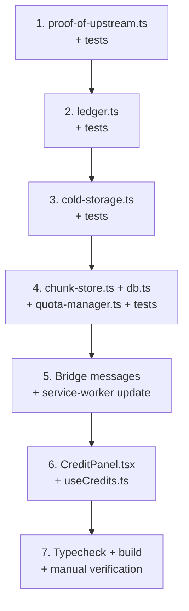

# Fase 2 — Motor de Créditos

> Sistema funcional de Proof of Upstream y ratio de ancho de banda.

---

## Contexto

Entropy Phase 1 (✅) entregó: chunking + hashing + Merkle tree, cliente Nostr, señalización WebRTC, web app mínima con uploader y extensión con seeding delegado persistente.

Phase 2 introduce la **economía de ancho de banda** — el mecanismo que convierte Entropy de un prototipo cooperativo en una red sostenible donde compartir es un requisito para consumir.

### Principios del sistema de créditos

| Concepto | Descripción |
|---|---|
| **Ratio 1:1** | Por cada MB descargado, el usuario debe haber subido ≥ 1 MB a la red. |
| **Proof of Upstream** | Recibo firmado por el receptor de un chunk que certifica la entrega exitosa. |
| **Créditos de Bienvenida** | Nuevos usuarios reciben 50-100 MB de crédito al completar tareas de seeding de contenido frío. |
| **Custodia de Chunks Fríos** | Usuarios con ratio alto reciben custodia de contenido poco popular; a cambio obtienen Créditos Premium. |

---

## Dependencias de Phase 1

Estos módulos ya existen y se reutilizan directamente:

- `@entropy/core` — `chunker.ts`, `merkle.ts`, `hash.ts`, `events.ts`, `nip-entropy.ts`, `client.ts`
- `@entropy/core` — `transport/peer-manager.ts`, `transport/signaling-channel.ts`
- `@entropy/extension` — `seeder.ts` (persistencia en `chrome.storage.local`)
- `@entropy/web` — `extension-bridge.ts` (comunicación web ↔ extensión)

---

## Entregables

### 1. `@entropy/core` — Submódulo `credits/`

#### 1.1 `proof-of-upstream.ts` — Generación y verificación de recibos

Implementa el protocolo de recibos firmados (NIP custom `kind:7772`).

**Tipos:**

```typescript
interface UpstreamReceipt {
  chunkHash: string;       // Hash SHA-256 del chunk transferido
  senderPubkey: string;    // Pubkey del seeder que entregó el chunk
  receiverPubkey: string;  // Pubkey del receptor que firma el recibo
  bytes: number;           // Bytes transferidos (tamaño del chunk)
  timestamp: number;       // Unix timestamp (segundos)
}

interface SignedReceipt extends UpstreamReceipt {
  signature: string;       // Firma Schnorr del receptor sobre el recibo
  eventId: string;         // ID del evento Nostr (kind:7772)
}
```

**Funciones:**

| Función | Descripción |
|---|---|
| `buildReceiptDraft(receipt: UpstreamReceipt)` | Construye un evento Nostr `kind:7772` sin firmar con tags `["p", seederPubkey]`, `["x", chunkHash]`, `["bytes", ...]`, `["receipt", timestamp]`. |
| `parseReceipt(event: NostrEvent): SignedReceipt` | Extrae los campos del recibo desde un evento Nostr firmado. |
| `isValidReceipt(receipt: SignedReceipt, expectedChunkHash: string): boolean` | Valida que el recibo corresponde al chunk esperado, la firma es válida, y el timestamp no es futuro ni demasiado antiguo (ventana configurable). |
| `receiptToBytes(receipt: SignedReceipt): number` | Extrae los bytes acreditados del recibo. |

**Decisión de diseño:** Los recibos se intercambian peer-to-peer vía el DataChannel de WebRTC inmediatamente después de la transferencia exitosa de un chunk. **No se publican** a relays (son privados). Opcionalmente, un subset puede publicarse para auditoría en una fase futura.

---

#### 1.2 `ledger.ts` — Registro local de créditos

Registro contable que trackea el ratio upload/download del usuario.

**Tipos:**

```typescript
interface CreditEntry {
  id: string;              // UUID autoincremental
  peerPubkey: string;      // Pubkey del peer involucrado
  direction: "up" | "down"; // "up" = subimos chunk, "down" = descargamos chunk
  bytes: number;           // Bytes acreditados/debitados
  chunkHash: string;       // Chunk específico
  receiptSignature: string; // Firma del recibo asociado
  timestamp: number;       // Unix timestamp
}

interface LedgerSummary {
  totalUploaded: number;   // Bytes totales subidos
  totalDownloaded: number; // Bytes totales descargados
  ratio: number;           // totalUploaded / totalDownloaded (Infinity si 0 descargados)
  balance: number;         // totalUploaded - totalDownloaded (en bytes)
  entryCount: number;      // Total de operaciones registradas
}
```

**Funciones:**

| Función | Descripción |
|---|---|
| `recordUpload(entry: Omit<CreditEntry, "id" \| "direction">)` | Registra una transferencia upstream (agrega crédito). |
| `recordDownload(entry: Omit<CreditEntry, "id" \| "direction">)` | Registra una descarga (debita crédito). |
| `getSummary(): LedgerSummary` | Calcula el resumen agregado: totales, ratio, balance. |
| `getBalance(): number` | Shortcut para `totalUploaded - totalDownloaded`. |
| `canDownload(requestedBytes: number): boolean` | Verifica si el usuario tiene suficiente crédito para descargar N bytes. |
| `getHistory(limit?: number): CreditEntry[]` | Retorna las últimas N entradas del ledger. |

**Almacenamiento:** v1 usa un array en memoria sincronizado a `localStorage` (web) o `chrome.storage.local` (extensión). v2 migrará a IndexedDB cuando se implemente el storage layer completo.

---

#### 1.3 `cold-storage.ts` — Asignación de custodia de chunks fríos

Lógica para asignar chunks poco populares a usuarios con ratio favorable.

**Tipos:**

```typescript
interface ColdChunkAssignment {
  chunkHash: string;       // Hash del chunk asignado
  rootHash: string;        // Archivo al que pertenece
  assignedAt: number;      // Timestamp de asignación
  expiresAt: number;       // Timestamp de vencimiento de custodia
  premiumCredits: number;  // Créditos premium otorgados por mantenerlo
}
```

**Funciones:**

| Función | Descripción |
|---|---|
| `isEligibleForColdStorage(summary: LedgerSummary): boolean` | Retorna `true` si el ratio del usuario es ≥ 2.0 (configurable). |
| `assignColdChunks(available: ColdChunkAssignment[]): ColdChunkAssignment[]` | Selecciona chunks para custodia, priorizando los menos replicados. |
| `calculatePremiumCredits(assignment: ColdChunkAssignment): number` | Calcula créditos premium basados en el tiempo de custodia y la rareza del chunk. |
| `pruneExpiredAssignments(assignments: ColdChunkAssignment[]): ColdChunkAssignment[]` | Elimina asignaciones vencidas. |

**Nota:** Esta es la implementación más especulativa de Phase 2. El sistema de asignación completo requiere descubrimiento de red (qué chunks existen y cuántas copias hay), que se implementará en fases posteriores. Aquí se implementa la **lógica de decisión local**: dado un set de assignments, qué aceptar y cómo calcular el crédito.

---

### 2. `@entropy/core` — Submódulo `storage/`

#### 2.1 `chunk-store.ts` — CRUD de chunks en IndexedDB

**Tipos (del modelo de datos de `architecture.md`):**

```typescript
interface StoredChunk {
  hash: string;            // SHA-256 del chunk (PK)
  data: ArrayBuffer;       // Contenido binario (≤5MB)
  rootHash: string;        // Hash raíz del archivo padre
  index: number;           // Posición en la secuencia
  createdAt: number;
  lastAccessed: number;    // Para política LRU
  pinned: boolean;         // Retención manual
}
```

**Funciones:**

| Función | Descripción |
|---|---|
| `storeChunk(chunk: StoredChunk): Promise<void>` | Almacena un chunk en IndexedDB. Actualiza `lastAccessed`. |
| `getChunk(hash: string): Promise<StoredChunk \| null>` | Recupera un chunk por hash. Actualiza `lastAccessed`. |
| `hasChunk(hash: string): Promise<boolean>` | Check rápido de existencia sin cargar datos. |
| `deleteChunk(hash: string): Promise<void>` | Elimina un chunk. |
| `listChunksByRoot(rootHash: string): Promise<StoredChunk[]>` | Lista todos los chunks de un archivo. |
| `getStoreSize(): Promise<number>` | Calcula el tamaño total en bytes. |

#### 2.2 `db.ts` — Schema y setup de Dexie.js

Setup mínimo de Dexie con tablas `chunks`, `credits`, y `peers`. Incluye versión de schema para migraciones futuras.

#### 2.3 `quota-manager.ts` — Control de cuota de disco

**Funciones:**

| Función | Descripción |
|---|---|
| `getQuotaInfo(): Promise<{used: number, available: number, limit: number}>` | Usa `navigator.storage.estimate()` + límite configurable. |
| `isWithinQuota(additionalBytes: number): Promise<boolean>` | Verifica si almacenar N bytes adicionales excede la cuota. |
| `evictLRU(bytesToFree: number): Promise<number>` | Evicta chunks LRU no-pinned hasta liberar N bytes. Retorna bytes efectivamente liberados. |
| `requestPersistence(): Promise<boolean>` | Solicita `navigator.storage.persist()`. |

---

### 3. `@entropy/core` — Tests

| Archivo | Cobertura |
|---|---|
| `proof-of-upstream.test.ts` | Construcción de recibos, parseo, validación de timestamps, detección de recibos inválidos. |
| `ledger.test.ts` | Registro de uploads/downloads, cálculo de ratio, verificación de balance, `canDownload`. |
| `cold-storage.test.ts` | Elegibilidad, asignación, cálculo de premium, pruning. |
| `chunk-store.test.ts` | CRUD de chunks, LRU access tracking, listado por rootHash. |
| `quota-manager.test.ts` | Estimación de cuota, evicción LRU, persistencia. |

---

### 4. `@entropy/extension` — Integración

#### 4.1 Nuevos mensajes en el bridge

| Mensaje | Dirección | Payload |
|---|---|---|
| `GET_CREDIT_SUMMARY` | Web → Ext | — |
| `CREDIT_SUMMARY` | Ext → Web | `LedgerSummary` |
| `CREDIT_UPDATE` | Ext → Web (push) | `LedgerSummary` (después de cada transferencia) |

#### 4.2 Cambios en `service-worker.ts`

- Manejar `GET_CREDIT_SUMMARY`: consultar el ledger y responder.
- Emitir `CREDIT_UPDATE` push después de cada `recordUpload` o `recordDownload`.

---

### 5. `@entropy/web` — UI de créditos

#### 5.1 `CreditPanel.tsx`

Componente nuevo en la web app que muestra:

- Ratio actual (barra visual)
- Balance en MB (upload - download)
- Botón de refresh
- Lista de últimas transacciones (historial)
- Indicador de elegibilidad para cold storage

#### 5.2 Hook `useCredits.ts`

Hook React que:
- Consulta `GET_CREDIT_SUMMARY` al montar
- Se suscribe a `CREDIT_UPDATE` pushes
- Expone `summary`, `isLoading`, `error`, `refresh()`

---

## Orden de implementación



**Estimación:** ~10-12 archivos nuevos, ~3-4 archivos modificados.

---

## Verificación

### Automatizada
```bash
pnpm --filter @entropy/core test    # Todos los unit tests
pnpm typecheck                       # 3/3 paquetes sin errores
pnpm --filter @entropy/extension build  # Build exitoso con IIFE content script
```

### Manual
1. Generar un chunk map en la web → verificar que `DELEGATE_SEEDING` acredita al uploader
2. Simular una descarga → verificar que el ledger debita correctamente
3. Verificar que `canDownload` bloquea cuando el balance es negativo
4. Verificar que `CreditPanel` renderiza el ratio y el historial
5. Recargar la extensión → verificar que el ledger persiste

---

## Riesgos y decisiones abiertas

> [!IMPORTANT]
> **Firma de recibos:** Phase 2 implementa la estructura del recibo (`kind:7772`) pero la firma real con Schnorr/secp256k1 requiere una librería criptográfica (`nostr-tools` o `@noble/secp256k1`). Propongo usar `nostr-tools` que ya se alinea con el stack Nostr.

usa nostr-tools

> [!WARNING]
> **Sin gating real:** Phase 2 construye el **registro contable** pero no implementa el **gating activo** (rechazar peers sin crédito). El gating requiere WebRTC connection establishment (Phase 3 remainder). El ledger estará listo para gating cuando se conecte al peer manager.

> [!NOTE]
> **Cold storage es especulativo:** La asignación de chunks fríos requiere visibilidad de red (cuántas copias de cada chunk existen). Phase 2 implementa la lógica de decisión local; la parte de descubrimiento de red se implementará en fases posteriores.
